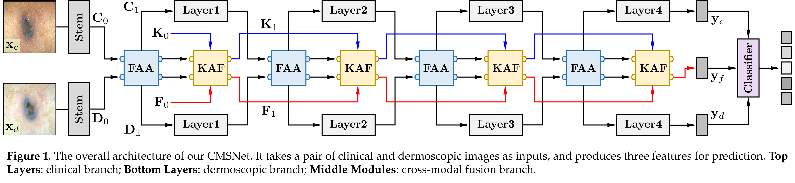

# CMSNet: Cross-Modal Affinity Learning for Medical Image Diagnosis with Knowledge-Guided Adaptive Fusion

This repository provides the official implementation of CMSNet, a cross-modal synergy network for multimodal medical image diagnosis. T

It is designed to improve cross-modal feature interaction for medical image recognition and clinical transparency for diagnostic decision-making through three key components:
1. **Feature Affinity Attention (FAA)** for modeling higher-order cross-modal feature affinity from intra-modal attention.
2. **Knowledge-guided Adaptive Fusion (KAF)** for progressively fusing multimodal features under the guidance of an evolving knowledge state.
3. **Dual-Reasoning Head (DRHead)** for combining rule-based reasoning with vision perception.

<p align="center">
  
</p>

**Paper**: Cross-Modal Affinity Learning for Medical Image Diagnosis with Knowledge-Guided Adaptive Fusion

**Authors**: Xiaole Zhao, Wenjia Yang, Jinghui Yang, Zhenyu Wu, Ao Luo, Yan Yang, Hua Ai

---

## ✨ Overview

Multimodal medical images provide complementary information for diagnosis, but effectively exploiting the interaction between different modalities remains challenging. Existing approaches often perform independent feature extraction followed by feature fusion, which may fail to capture fine-grained cross-modal relationships. 

CMSNet addresses this problem through a progressive cross-modal reasoning framework. Given paired medical images from different modalities, CMSNet contains two modality-specific branches and a cross-modal fusion branch. The network is composed of multiple stages, with each stage containing an FAA module and a KAF module.


## 项目结构

```
CMSNet/
├── main.py           # 训练入口
├── test.py           # 测试 / 推理入口
├── model.py          # 网络结构（MLCNN）
├── dataloader.py     # 数据加载与增强
├── dependency.py     # 全局配置（路径、超参数等）
├── evaluate.py       # 评估指标
├── require.sh        # 依赖安装脚本
└── release_v0/       # 数据集划分索引与元信息
```

训练与测试均通过 `dependency.py` 中的配置项控制，无需额外命令行参数。

---

## 环境依赖

建议使用 **Python 3.8+** 与 **CUDA** 环境。

### 安装

在 `CMSNet` 目录下执行：

```bash
pip install torch torchvision
bash require.sh
pip install pandas numpy tqdm matplotlib scikit-learn
```

---

## 训练

在 `CMSNet` 目录下运行：

```bash
python main.py
```

---

## 测试

```bash
python test.py
```

---
